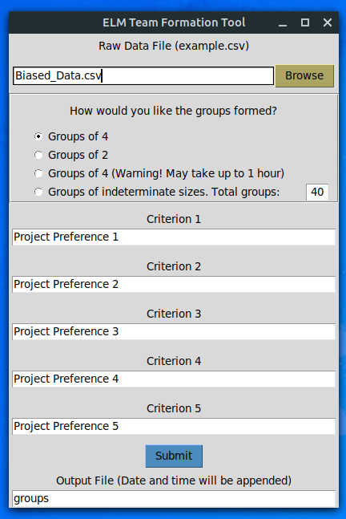

# elm_team_formation

## INTRODUCTION:

This is a simple code and GUI to create teams for the Experiential Learning Module (ELM) of the Young India Fellowship. This code was born out of necessity, as the batch of 2020 will be the first (and hopefully only) YIF batch to begin their fellowship online, and as a result might not be able to get to know their batchmates well enough to form optimum teams with mutually shared interests.

### What this program does

The code forms groups out of a list of any number of students. (It has been tested on up to 300 students.) Three options exist: 

- Create groups of two members (pairs) based on compatibility
- Create groups of exactly four members (if the number of students is not a multiple of four, one group will have fewer than four members) based on overall compatibility
- Create groups of indeterminate sizes (the algorithm for this is slightly different from the other two)

The compatibility between two individuals is calculated on the basis of up to 5 criteria selected in the GUI. These criteria may be the five project preferences, the three domains, two domains and three preferences, and so on. A simple algorithm (descibed in the section below) gives a score to all possible pairs of individuals, and chooses that pair which has the highest score. (If more than one exists, one is chosen randomly.)

All the individual students are first paired, either with their preferred teammate or -- if they have not chosen a preferred teammate -- with other students who share their interests. These pairs are then further paired into "quartets", based on their overall mutual compatibility.

### What this program *doesn't* do

Simply put, this program is not magic. Team formation is a horribly difficult exercise (and -- more importantly -- a thankless one) with many, *many* different parameters to take into account. This tool certainly does not claim that you will be happy with all your teammates. What it does do is find (with some acceptable level of uncertainty) other people who have the same shared interests as you. The assumption being that if you have the same interests, and you have rated them in the same order, then you would probably be suited to work with each other. This is debatable, but a deliberate choice on our part as we see no better way of doing this.

However, team formation is inherently subjective, and the code does not claim to do all the work. It is for this reason that the "default" option is to create groups of 4 members each. Since the ELM teams consist of 5 to possibly 6 members, the YIF Program Team will manually break up a certain number of "badly matched" groups and manually assign these students to other groups. In other words, the code is only "Part 1" of the team formation process.

## USING THE PROGRAM:

### Installation

The code is originally written on Python 3, and the entire code can be found in the *ELM_Team_Formation_Code.py* file. However, understanding that those most likely to use this code are not particularly comfortable with python, I have created a Windows executable, *ELM_Team_Formation_Code.exe* as well as a mac executable *ELM_Team_Formation_Code.app*, both of which can be found in the `dist` folder. The .exe file can be downloaded from the browser, however the mac executable will appear as a folder and so cannot be downloaded directly. If you wish to use it, I would suggest downloading the entire repository by clicking the `Clone` button above and choosing `Download ZIP`. 

All you need to run this code are the executable for your operating system, and a data file. None of the other files should be necessary, they are mainly there for housekeeping. The .exe and .app files *need no installation*. They should not require any permissions to run. When you run the executable, you should see a simple GUI like this which should be quite self-explanatory. If you have any issues with this, please let me know.

### The raw data file
The code works on data provided by a CSV file, a sample template is the file *Final_Sample_Data.csv* in the repository. (You can use the "Browse" button to select a file.) Such a file requires some characteristic features which the GUI allows you to select:

1. **A unique identifier per student:** This is used to differentiate the different students, and so *no* duplicates should exist. Beware of students having the same first names or even full names! The list of email addresses would be ideal.

2. **A "preferred team-mate" column:** Each students is given the option to opt for *at most one* preferred team-mate, however the assumption is that their preferred team-mate has opted for them as well. If this is not satisfied, **the code will still run, but preferred teams are not guaranteed for everyone**. Two additional important points *must* be checked for manually before the code is run:

     * **The preferred team-mate should be indexed by the *same* identifier as the unique identifier mentioned earlier**. (i.e. don't use, say, the student's email address to be the UID, but have the preferred team-mate to be populated by full-names, for example.) 
     * Also, each pair of teammates will be assumed to have exactly the same preferences. 
  
3. **Up to five preferences by which the teams can be formed:** These could be project preferences, domain choices, etc. They will be given weightages according to their order, so make sure they are entered in the right order on the GUI. Not all five preferences are needed, the code should work with any non-zero number of criteria.

### The output file

The output file (CSV) will be created in the same folder from which the code is run. The GUI allows for the name of the output to be changed, but every output file will have the current date and time appended to this name, in order to avoid overwrites. (For example, if you choose to name the output file "groups", the actual name of the output will be *groups-2020-Aug-09_11-23-17.csv*.)

The output reorders the lines from the input file, adding a single extra line per group, indicating the group number and a "satisfaction" percentage per group. (Currently, the satisfaction percentage does not work for groups of indeterminate sizes.) More details on how this percentage is calculated may be found in the section describing the algorithm.

